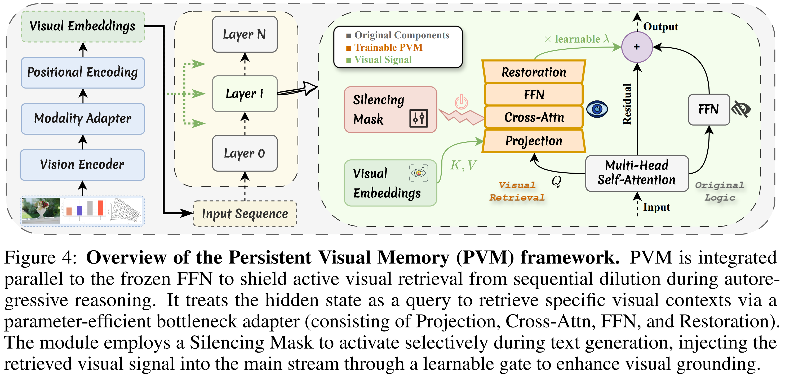
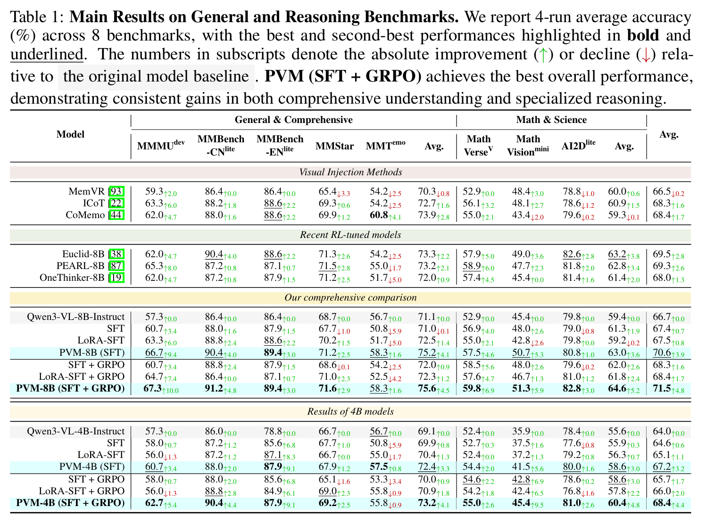

# Persistent Visual Memory: Sustaining Perception for Deep Generation in LVLMs

Persistent Visual Memory (PVM) is a lightweight parallel visual retrieval branch for autoregressive
large vision-language models. It is designed to mitigate visual signal dilution: as generated text
gets longer, the fixed visual tokens at the beginning of the context receive less attention. PVM keeps
an independent cross-attention path over the original visual embeddings, allowing the language
backbone to retrieve visual evidence without inserting extra visual tokens into the autoregressive
stream.

---

<div align="center">

</div>

---

<div align="center">

</div>

---

## Repository Status

This is the official repository for Persistent Visual Memory (PVM). It includes the model
implementation and training entry points, but does not include pretrained checkpoints, local dataset
copies, or cluster-specific DeepSpeed configuration files.

Included:

- PVM-enhanced Qwen3-VL model definition.
- Supervised fine-tuning (SFT) entry point.
- GRPO policy-refinement entry point.
- Overview and result figures.

## Method Summary

PVM is implemented as a bottleneck adapter parallel to selected Transformer FFN blocks:

1. Project text hidden states and original visual embeddings into a lower-dimensional latent space.
2. Run text-to-vision cross-attention whose keys and values are restricted to the fixed visual set.
3. Apply a lightweight MLP, restore the feature to the model hidden size, and add it through a
   learnable gate initialized at zero.

The paper uses intermediate injection layers:

- Qwen3-VL-8B: layers `8, 16, 24`
- Qwen3-VL-4B: layers `5, 11, 17`
- PVM latent dimension: `512`

## Repository Layout

```text
.
|-- README.md
|-- overview.png
|-- results.png
|-- modeling_file/
|   |-- configuration_qwen3_vl.py
|   `-- modeling_qwen3_vl.py
`-- training_file/
    |-- SFT.py
    `-- GRPO.py
```

`modeling_file/configuration_qwen3_vl.py` defines the PVM-aware Qwen3-VL configuration classes.
The relevant configuration fields are `pvm_hidden_size` and `pvm_layers`.

`modeling_file/modeling_qwen3_vl.py` implements the PVM branch as `PVMMemoryBlock`, including
the latent cross-attention, latent MLP, zero-initialized output projection, and gated residual fusion.

`training_file/SFT.py` trains only PVM-related parameters for visual-memory alignment.

`training_file/GRPO.py` performs GRPO refinement with the vision encoder frozen and the language
backbone/PVM modules trainable.

## Environment

The full experiments were run with PyTorch, Hugging Face Transformers, TRL, DeepSpeed,
FlashAttention-2, and lmms-eval. A typical environment is:

```bash
conda create -n pvm python=3.10
conda activate pvm

pip install torch transformers datasets accelerate trl deepspeed pandas swanlab mathruler
pip install flash-attn --no-build-isolation
pip install lmms-eval
```

FlashAttention-2 requires a compatible CUDA/PyTorch build. If it is not available, remove
`attn_implementation="flash_attention_2"` from the training scripts for debugging, at the cost of
speed and memory.

## Preparing a PVM Checkpoint Directory

The training scripts load the model with `trust_remote_code=True`. The model directory should
contain the Qwen3-VL checkpoint files plus the PVM modeling files:

```text
<model_path>/
|-- config.json
|-- configuration_qwen3_vl.py
|-- modeling_qwen3_vl.py
|-- model-00001-of-xxxxx.safetensors
|-- ...
```

Copy the files from `modeling_file/` into the checkpoint directory and ensure `config.json` points
to the custom classes. Merge the PVM fields into the existing Qwen3-VL config rather than replacing
the full config. The exact `auto_map` fields depend on the Transformers version, but should map the
config and image-text model auto classes to:

```json
{
  "architectures": ["PVMQwen3VLForConditionalGeneration"],
  "text_config": {
    "pvm_hidden_size": 512,
    "pvm_layers": [8, 16, 24]
  },
  "auto_map": {
    "AutoConfig": "configuration_qwen3_vl.PVMQwen3VLConfig",
    "AutoModelForImageTextToText": "modeling_qwen3_vl.PVMQwen3VLForConditionalGeneration"
  }
}
```

For the 4B setting, use `pvm_layers: [5, 11, 17]`.

## Data Preparation

The paper uses two training splits:

- SFT alignment data: 526k visually centered samples filtered from OpenMMReasoner-SFT-874K.
- GRPO refinement data: 3.6k complex reasoning queries aggregated from MMK12,
  ThinkLite-VL-hard, ViRL39K, and We-Math2.0-Pro.

## Training

Edit the placeholders at the top of each script before launching.

For SFT:

```python
model_path = "<path_to_pvm_qwen3_vl_checkpoint>"
output_dir = "<path_to_sft_output>"
run_name = "<run_name>"
train_dataset = load_from_disk("<path_to_sft_dataset>")
```

Then run:

```bash
accelerate launch --config_file <zero2_config.yaml> training_file/SFT.py
```

For GRPO:

```python
model_name = "<path_to_sft_checkpoint>"
dataset_id = "<path_to_grpo_dataset>"
output_dir = "<path_to_grpo_output>"
```

Then run:

```bash
accelerate launch --config_file <zero3_config.yaml> training_file/GRPO.py
```

The paper uses the following training setup:

| Setting | SFT alignment | GRPO refinement |
| --- | --- | --- |
| Optimizer | AdamW | AdamW |
| Learning rate | `1e-4` | `1e-6` |
| Scheduler | Cosine | Constant |
| Warmup ratio | `0.1` | `0.0` |
| Global batch size | `64` | `64` |
| Per-device batch size | `1` | `1` |
| Gradient accumulation | `8` | `8` |
| Vision encoder | Frozen | Frozen |
| LLM backbone | Frozen | Trainable |
| PVM modules | Trainable | Trainable |
| Projector | Frozen | Frozen |
| GRPO group size | N/A | `8` |
| Max completion length | N/A | `16384` |

Full-scale training used 8 NVIDIA H200 GPUs with 141 GB VRAM per GPU. SFT used DeepSpeed ZeRO-2;
GRPO used DeepSpeed ZeRO-3.

## Evaluation

The paper evaluates with `lmms-eval` at inference temperature `0.7` on:

- MMMU
- MMBench-CN
- MMBench-EN
- MMStar
- MMT
- MathVerse
- MathVision
- AI2D

Use the checkpoint produced by the GRPO stage and the same benchmark versions as the paper.

## Main Results

Average accuracy across the eight evaluation benchmarks:

| Model | Average accuracy |
| --- | ---: |
| Qwen3-VL-8B-Instruct | 66.7 |
| PVM-8B SFT | 70.6 |
| PVM-8B SFT + GRPO | 71.5 |
| Qwen3-VL-4B-Instruct | 64.0 |
| PVM-4B SFT | 67.2 |
| PVM-4B SFT + GRPO | 68.4 |

The 8B PVM model adds 27.92M trainable parameters, about 0.32% of the 8B backbone.
